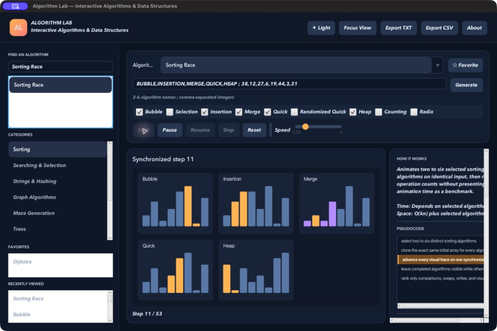
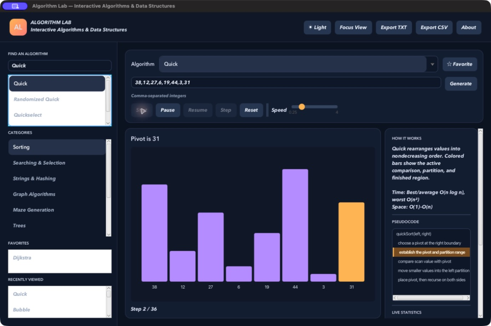
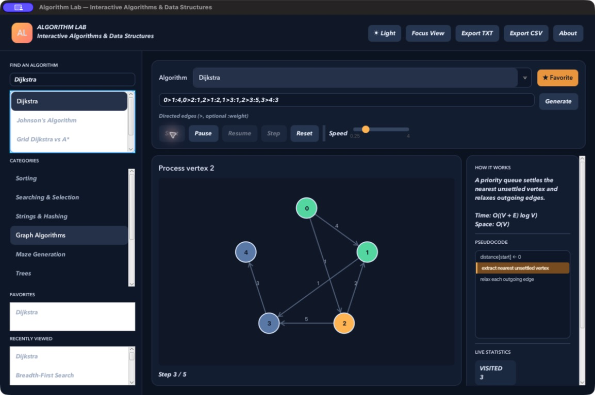
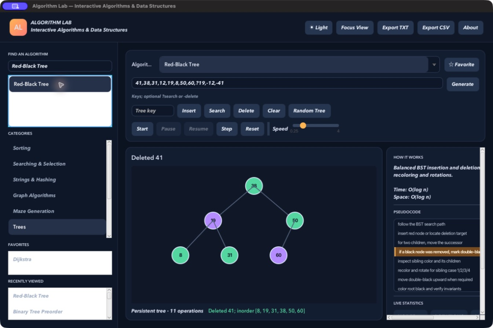
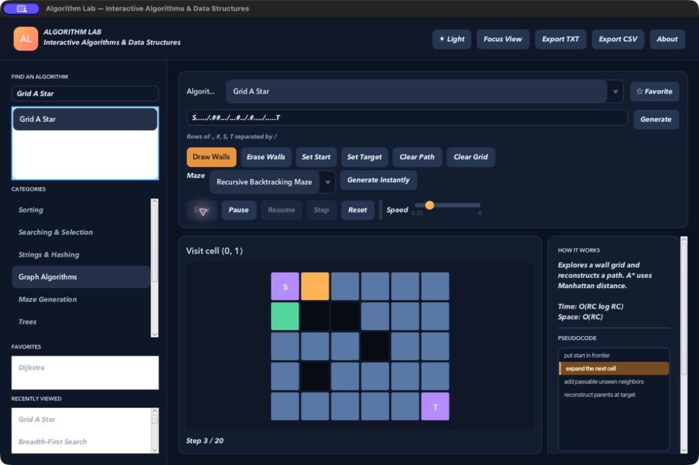

# Algorithm Lab

An interactive JavaFX laboratory that turns real algorithm executions into inspectable, step-by-step visual explanations.

[](https://openjdk.org/)
[](https://openjfx.io/)
[](https://maven.apache.org/)
[](https://github.com/wesam-al-hayani/algorithm-visualizer/actions/workflows/ci.yml)



Algorithm Lab contains **83 runnable demonstrations across 10 categories**. Algorithm logic is independent of JavaFX, every visible demo runs its real implementation, and each playback frame exposes the state change that produced it. The application combines standard visualizations with interactive tree and grid labs, comparison modes, empirical analysis, export, search, favorites, recent history, themes, focus mode, and keyboard control.

## Screenshots

These images were captured from the packaged application, not mockups.

| Sorting | Graph shortest path |
| --- | --- |
|  |  |
| **Interactive tree lab** | **Grid pathfinding** |
|  |  |
| **Comparison mode** | |
|  | |

## What You Can Explore

- Sorting and selection, including synchronized two-sort comparison and a 2–6 algorithm race
- String matching and open-addressed or chained hashing
- Traversal, shortest paths, all-pairs shortest paths, spanning trees, SCCs, low-link algorithms, Euler paths, matching, and network flow
- Interactive BST, AVL, Red-Black, and B-Tree operations with invariant-aware repair events
- Binary, binomial, and Fibonacci heaps
- Dynamic programming, branch and bound, exact exponential algorithms, and approximation
- Five real maze generators with editable grids, drag drawing, erase mode, and undo/redo
- Measured complexity curves and repeatable deterministic-vs-randomized Quick Sort experiments

The complete implementation and test matrix is in [Algorithm Coverage](docs/ALGORITHM_COVERAGE.md).

## Requirements

- JDK 17 or newer; JDK 21 is recommended
- macOS, Linux, or Windows with a desktop environment
- `curl` and `tar` only for the repository-local Maven launcher's first run

No global Maven installation is required.

## Run

```bash
./mvnw javafx:run
```

The first invocation downloads Apache Maven into the ignored `.mvn/` directory. JavaFX is resolved for the current platform.

## Test and Build

```bash
./mvnw --batch-mode clean test
./mvnw --batch-mode -DskipTests package
```

JaCoCo enforces at least 80% line coverage across the UI-independent algorithm, data-structure, and state-management core. GitHub Actions tests and packages the project on Linux, macOS, and Windows.

## Using the Lab

1. Select a category or search for an algorithm.
2. Select a demo, then use its documented example or edit the input.
3. Choose **Start** for continuous playback or **Step** for exactly one logical frame.
4. Pause, resume, reset, generate another input, or change the speed at any time.
5. Use **Export TXT** or **Export CSV** to save the current explanation, input, state, statistics, and details.

Graph input accepts `0-1:4` for an undirected weighted edge and `0>1:4` for a directed edge. Hash labs use integers for insertion, `?34` for search, and `-23` for deletion. Grid rows are separated by `/` and use `.`, `#`, `S`, and `T`; the toolbar supports wall drawing, erasing, moving endpoints, maze generation, and undo/redo.

### Keyboard Shortcuts

| Shortcut | Action |
| --- | --- |
| `Ctrl/Cmd + K` | Focus algorithm search |
| `Space` | Start, pause, or resume |
| `Right Arrow` | Advance one frame while paused |
| `Ctrl/Cmd + R` | Reset the current run |
| `Ctrl/Cmd + G` | Generate a new input |
| `Ctrl/Cmd + Z` / `Shift + Ctrl/Cmd + Z` | Undo / redo grid edits |
| `F` | Toggle focus mode |
| `T` | Toggle light / dark theme |

## Implemented Algorithms

### Sorting, Searching, Strings, and Hashing

Bubble, Selection, Insertion, Merge, Quick, Randomized Quick, Heap, Counting, and Radix Sort; Linear and Binary Search; Quickselect and Median of Medians; Naive String Matching, KMP, and Rabin–Karp; Separate Chaining, Linear Probing, Quadratic Probing, and Double Hashing.

### Graphs, Paths, Matching, and Flow

BFS, DFS, Connected Components, Topological Sort, Kosaraju SCC, Tarjan SCC, Bridges, Articulation Points, directed and undirected Euler Path/Circuit, Bipartite Check, Dijkstra, Bellman–Ford, Floyd–Warshall, Johnson's Algorithm, weighted-graph A*, Kruskal, Prim, Union-Find, Edmonds–Karp, Dinic, simple Maximum Bipartite Matching, and Hopcroft–Karp. Comparison labs cover Grid Dijkstra vs A*, four shortest-path algorithms, and Edmonds–Karp vs Dinic.

### Trees, Heaps, Optimization, Matrix, and Analysis

Tree traversals; fully interactive Binary Search, AVL, Red-Black, and B-Trees including deletion; Binary Min/Max Heap, Priority Queue, Binomial Heap, and Fibonacci Heap; 0/1 Knapsack, Branch-and-Bound Knapsack, Held–Karp and brute-force TSP, exact and 2-approximation Vertex Cover, Max Cut, MaxSAT; Strassen multiplication; asymptotic growth, Master Theorem, amortized arrays, experimental complexity, and repeated Quick Sort experiments.

### Grids and Mazes

Grid BFS, DFS, Dijkstra, and A* plus Random Walls, Recursive Backtracking, Recursive Division, Randomized Prim, and Randomized Kruskal maze generation. Every generated maze preserves a path between exactly one start and one target.

## Architecture

```text
UI-independent algorithm / data structure
                  ↓
             AlgorithmRun
                  ↓
             AlgorithmStep
                  ↓
          PlaybackController
                  ↓
        VisualizationCanvas
```

```text
src/main/java/dev/wesam/visualizer/
├── algorithms/    # Real algorithms and measurement paths
├── structures/    # Mutable teaching structures plus invariant checks
├── catalog/       # 83 demo adapters, explanations, and pseudocode
├── model/         # Immutable runs, steps, statistics, and visual kinds
├── ui/            # Playback, editing, history, input, export, and rendering
└── AlgorithmVisualizerApp.java
src/test/java/     # Unit, invariant, randomized, cross-validation, and smoke tests
docs/              # Learning, architecture, testing, and coverage guides
scripts/           # Safe checkpoints and distribution tooling
```

Read [Architecture](docs/ARCHITECTURE.md) for the design and extension points, [Learning Guide](docs/LEARNING_GUIDE.md) for a suggested study path, and [Testing](docs/TESTING.md) for verification strategy and commands.

## Design and Safety Notes

- Playback frames describe logical work, not wall-clock benchmark time. Count-only implementations power empirical experiments without animation overhead.
- Exponential demos have explicit input limits: dynamic-programming TSP supports 18 cities and brute force 10 in the core; the UI uses lower interactive limits where helpful.
- Exact Vertex Cover is bounded to 18 vertices; Max Cut and core MaxSAT to 20; the UI limits MaxSAT to 18.
- Counting Sort rejects impractically large key ranges, and every parser reports the selected demo's expected format and example.
- Red-Black and B-Tree deletion use their actual repair algorithms; they are validated with structural invariants and randomized mixed operations.
- Visualizations prioritize clear, deterministic logical transitions over decorative micro-animation.

## Checkpoint Workflow

Development is preserved on `codex-work` until the complete V2 release passes its quality gate. A safe checkpoint is:

```bash
scripts/checkpoint.sh "feat: describe this checkpoint"
```

The helper stages changes, commits, and attempts a non-destructive push. A failed push leaves the local commit intact and never rolls work back.

## Technology

Java 17 language level, JavaFX 21, Maven, JUnit 5, and JaCoCo. The application itself has no third-party runtime dependency beyond JavaFX.

## License

This repository is provided for educational and portfolio use. See [LICENSE](LICENSE).
